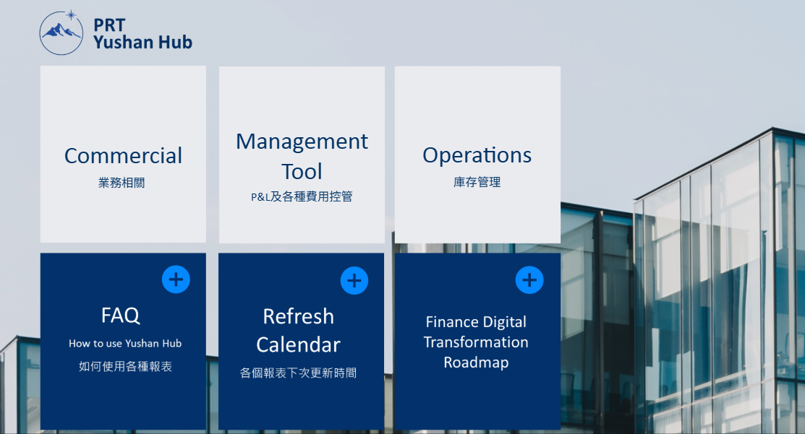
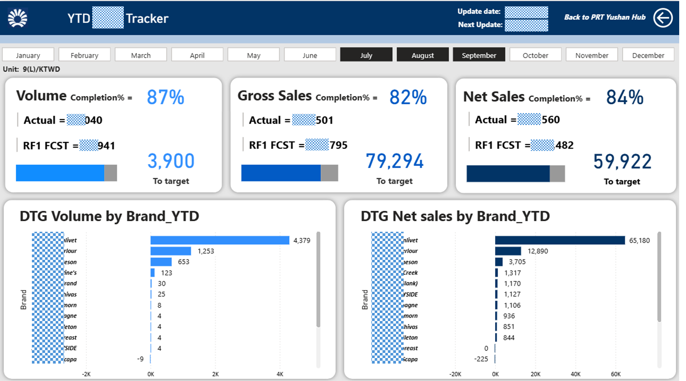
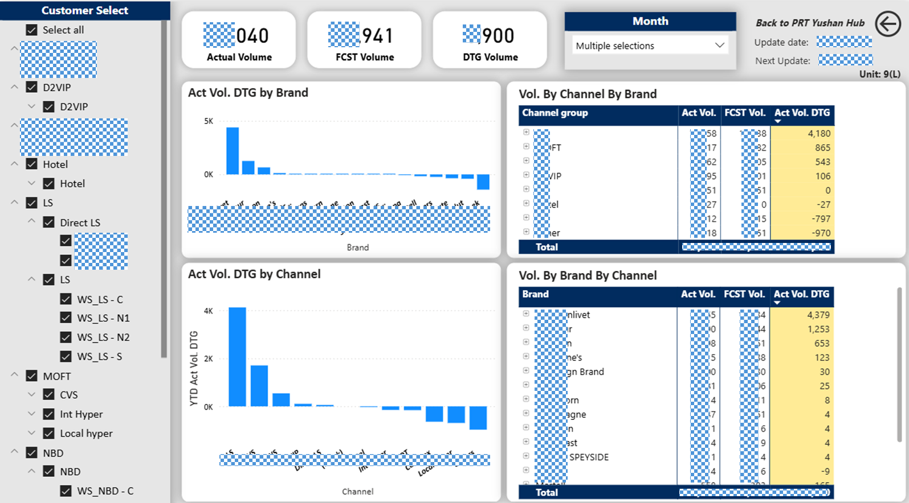
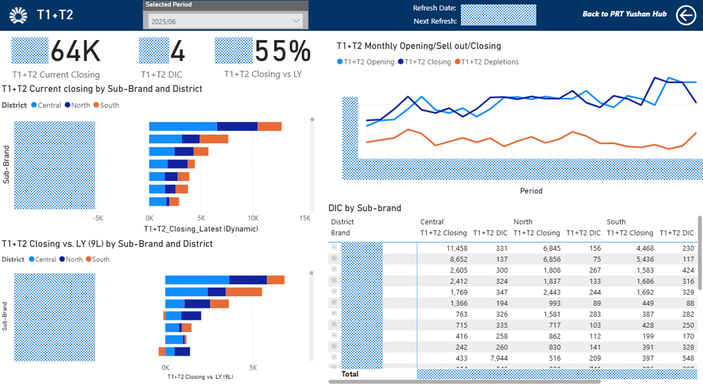
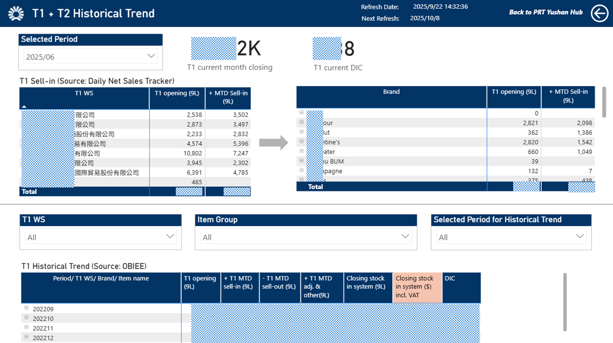
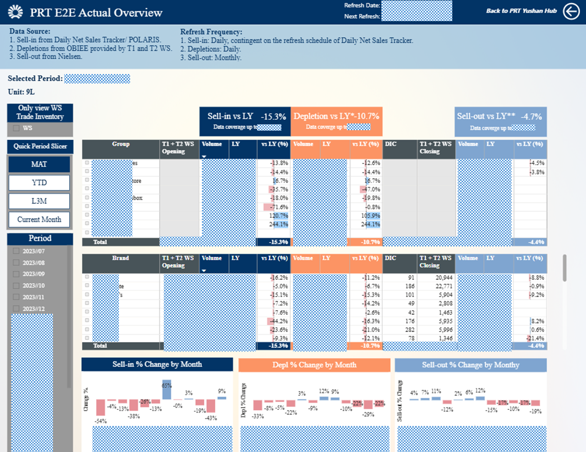
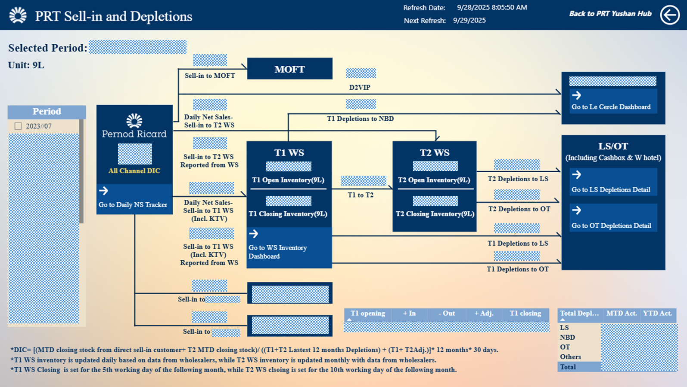

# Yushan Hub – Power BI + Automation Solution for Pernod Ricard Taiwan

Yushan Hub is a centralized data and reporting platform designed for PRT to streamline sales, inventory, and market performance monitoring. It is built on Power BI, supported by Snowflake, Python, Power Automate, and SharePoint integrations.

## 🧾 Features

- Centralized dashboard access via SharePoint portal
- Real-time refresh logic (daily / weekly) connected to Sonwflake, Salesforce, and SharePoint files
- Strict access control (Pernod Ricard Global Data Governance Matrix Level 1+)
- Dashboard coverage: Sell-in, Depletions, Sell-out, A&D, A&P, Inventory, Shipment, Shipment forecast

## 🔁 Refresh & Automation Logic

- **Scheduled Data Refresh**: Power BI dashboards are refreshed daily or weekly using Power BI Scheduled Refresh.
- **Snapshot File Strategy**: Excel data sources are saved as snapshots to prevent disruptions from live editing and ensure consistent refresh.
- **Trigger Notifications**: Selective workflows use SharePoint versioning or Power Automate to notify data updates.

## 📊 Data Governance

- Roles: Data Owner, Steward, Organizer
- Control aligned with HQ Data guidelines and Code of Duty MOOC

## 📷 Sample Dashboards

Daily Net Sales Tracker 

 

WS Trade Inventory

 

Depletions Cockpit

 

## 📁 Project Structure

See [docs/](docs/) for full documentation.
